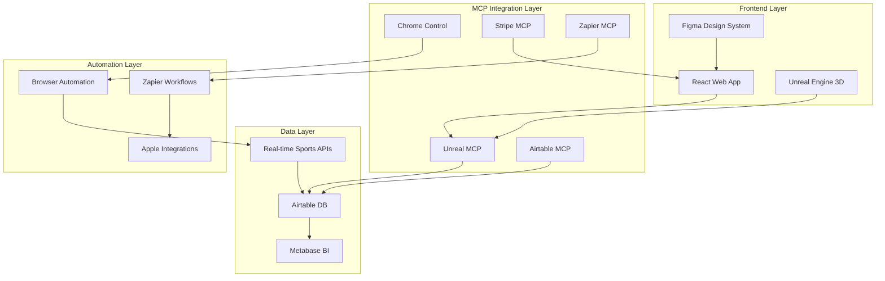

# 🚀 BLAZE INTELLIGENCE SUPERCHARGE PLAN
## Multi-MCP Integration Architecture for Next-Generation Sports Platform

---

## 🎯 VISION: Transform Blaze Intelligence into the World's Most Advanced Sports Analytics Platform

By integrating all available MCP connectors with Unreal Engine capabilities, we'll create:
- **3D Interactive Sports Visualizations** powered by Unreal Engine
- **Real-time Data Pipeline** using multiple data sources
- **Advanced Automation** through Zapier and browser control
- **Enterprise Business Intelligence** via Metabase and Airtable
- **Visual Design System** through Figma integration
- **Comprehensive Analytics** combining multiple platforms

---

## 🏗️ PHASE 1: UNREAL ENGINE INTEGRATION
### 3D Sports Visualization Platform

#### 1.1 Stadium & Field Visualization
```javascript
// Create 3D sports environments in Unreal
- NFL Stadium with real field dimensions
- NBA Court with player positions
- MLB Diamond with ball trajectory paths
- Soccer Field with heat maps
```

**Implementation:**
- Use Unreal MCP to create actor-based sports fields
- Dynamic lighting for day/night games
- Weather effects (rain, snow, wind indicators)
- Crowd simulation for atmosphere

#### 1.2 Player Movement Tracking
```javascript
// Real-time player position visualization
- 3D player models positioned from live data
- Movement trails showing play patterns
- Speed/acceleration indicators
- Collision detection for contact sports
```

#### 1.3 Ball Physics Simulation
```javascript
// Accurate ball trajectory modeling
- Football spiral and arc calculation
- Basketball shot trajectory with rim physics
- Baseball pitch movement visualization
- Soccer ball curve and spin effects
```

#### 1.4 Interactive Camera System
```javascript
// Multiple viewing angles
- Broadcast camera angles
- Player POV cameras
- Drone/aerial views
- User-controlled free camera
```

---

## 🎨 PHASE 2: FIGMA DESIGN SYSTEM INTEGRATION

#### 2.1 Dynamic UI Component Library
```javascript
// Figma-to-React Pipeline
- Auto-generate React components from Figma designs
- Live design token synchronization
- Theme switching (team colors)
- Responsive component variants
```

#### 2.2 Team Branding System
```javascript
// Automated brand application
- Pull team colors/logos from Figma
- Dynamic theme generation per team
- Custom team dashboards
- Branded sharing templates
```

#### 2.3 Data Visualization Templates
```javascript
// Figma chart components
- Heat maps for player positions
- Shot charts for basketball
- Strike zone visualizations
- Field position analytics
```

---

## 📊 PHASE 3: AIRTABLE DATA MANAGEMENT

#### 3.1 Comprehensive Sports Database
```javascript
// Structured data tables
Tables:
- Players (stats, bio, performance metrics)
- Teams (rosters, schedules, standings)
- Games (scores, play-by-play, conditions)
- Predictions (AI predictions, accuracy tracking)
- Users (preferences, subscriptions, activity)
```

#### 3.2 Real-time Sync Pipeline
```javascript
// Airtable ↔ Blaze Intelligence sync
- Webhook triggers for data updates
- Batch processing for historical data
- Conflict resolution for concurrent edits
- Backup and recovery procedures
```

#### 3.3 Advanced Analytics Views
```javascript
// Custom Airtable interfaces
- Player comparison matrices
- Team performance dashboards
- Season progression tracking
- Fantasy sports optimization
```

---

## 🤖 PHASE 4: BROWSER AUTOMATION & SCRAPING

#### 4.1 Chrome Automation Pipeline
```javascript
// Automated data collection
- Scrape live scores from multiple sources
- Capture injury reports in real-time
- Monitor betting odds changes
- Track social media sentiment
```

#### 4.2 Visual Data Extraction
```javascript
// Screenshot and image analysis
- Capture game highlights
- Extract stats from broadcast graphics
- Monitor stadium attendance visually
- Generate thumbnail previews
```

#### 4.3 Automated Testing Suite
```javascript
// Quality assurance automation
- Cross-browser compatibility testing
- Performance monitoring across devices
- User journey validation
- A/B test execution
```

---

## 💳 PHASE 5: ENHANCED STRIPE WORKFLOWS

#### 5.1 Dynamic Pricing Engine
```javascript
// AI-powered pricing optimization
- Surge pricing for big games
- Team-specific promotions
- Loyalty discounts
- Group subscription packages
```

#### 5.2 Advanced Subscription Features
```javascript
// Subscription management
- Pause/resume subscriptions
- Gift subscriptions
- Team/league packages
- Pay-per-view events
```

#### 5.3 Revenue Analytics
```javascript
// Financial intelligence
- MRR/ARR tracking
- Churn prediction models
- LTV optimization
- Cohort analysis
```

---

## ⚡ PHASE 6: ZAPIER AUTOMATION WORKFLOWS

#### 6.1 User Engagement Automations
```javascript
Triggers → Actions:
- New user signup → Send personalized welcome series
- Favorite team scores → Push notification + email
- Subscription expires → Win-back campaign
- High engagement → Upgrade offer
```

#### 6.2 Content Distribution
```javascript
Automated publishing:
- Game predictions → Social media posts
- AI insights → Blog articles
- Highlights → YouTube uploads
- Stats updates → Newsletter content
```

#### 6.3 Data Pipeline Automation
```javascript
Data flows:
- SportsRadar → Airtable → Analytics
- User actions → Mixpanel → Metabase
- Stripe events → Customer success workflows
- Support tickets → Notion documentation
```

---

## 📈 PHASE 7: BUSINESS INTELLIGENCE (METABASE)

#### 7.1 Executive Dashboards
```javascript
// C-suite metrics
- Revenue trends and forecasts
- User acquisition costs
- Market penetration by region
- Competitive analysis
```

#### 7.2 Operational Intelligence
```javascript
// Real-time operations
- Server performance metrics
- API usage and limits
- Error rates and debugging
- User session analytics
```

#### 7.3 Predictive Analytics
```javascript
// ML-powered insights
- Churn prediction models
- Revenue forecasting
- User behavior clustering
- Content recommendation engine
```

---

## 📱 PHASE 8: APPLE ECOSYSTEM INTEGRATION

#### 8.1 iMessage Sports Bot
```javascript
// Conversational interface
- Request scores via iMessage
- Receive game alerts
- Share predictions with friends
- Group betting pools
```

#### 8.2 Apple Notes Integration
```javascript
// Personal sports journal
- Save favorite plays
- Track betting history
- Store draft strategies
- Sync across devices
```

#### 8.3 Mac System Automation
```javascript
// Desktop integration
- Menu bar score ticker
- Spotlight search for stats
- Calendar game reminders
- Safari extension for quick lookups
```

---

## 🔬 PHASE 9: SPECIALIZED DATA SOURCES

#### 9.1 Health & Performance Data (PopHIVE)
```javascript
// Player health analytics
- Injury prediction models
- Recovery time estimates
- Performance optimization
- Fatigue indicators
```

#### 9.2 Business Intelligence (Explorium)
```javascript
// Market analysis
- Fan demographic insights
- Sponsorship opportunities
- Merchandise demand prediction
- Regional popularity trends
```

#### 9.3 Security Monitoring (Socket)
```javascript
// Platform security
- Dependency vulnerability scanning
- Real-time threat detection
- Compliance monitoring
- Data breach prevention
```

---

## 🎭 PHASE 10: TESTING & QUALITY ASSURANCE

#### 10.1 Cucumber Studio Integration
```javascript
// BDD test scenarios
Feature: Live Score Updates
  Scenario: User receives real-time scores
    Given user has favorite teams selected
    When a game score changes
    Then user receives push notification
    And dashboard updates immediately
```

#### 10.2 Kapture Browser Testing
```javascript
// Cross-browser validation
- Chrome, Firefox, Safari, Edge testing
- Mobile browser compatibility
- Progressive web app features
- Performance benchmarking
```

---

## 🚀 IMPLEMENTATION ROADMAP

### Week 1-2: Foundation
- [ ] Set up Unreal Engine development environment
- [ ] Configure all MCP connectors
- [ ] Create base integration architecture
- [ ] Establish data pipelines

### Week 3-4: Core Features
- [ ] Build 3D stadium visualization
- [ ] Implement Figma design sync
- [ ] Set up Airtable database
- [ ] Configure Stripe enhancements

### Week 5-6: Automation
- [ ] Create Zapier workflows
- [ ] Implement browser automation
- [ ] Set up Metabase dashboards
- [ ] Configure Apple integrations

### Week 7-8: Advanced Features
- [ ] Deploy Unreal Engine visualizations
- [ ] Launch automated testing suite
- [ ] Implement predictive analytics
- [ ] Complete security hardening

### Week 9-10: Optimization
- [ ] Performance tuning
- [ ] A/B testing implementation
- [ ] Revenue optimization
- [ ] User experience refinement

---

## 💡 UNIQUE SELLING PROPOSITIONS

### 1. **3D Game Visualization**
First sports platform with real-time 3D game reconstruction using Unreal Engine

### 2. **AI-Powered Everything**
Every aspect enhanced by AI - from predictions to pricing to personalization

### 3. **Omnichannel Experience**
Seamless across web, mobile, iMessage, and native Mac apps

### 4. **Enterprise-Grade Analytics**
Business intelligence that rivals Fortune 500 companies

### 5. **Automated Operations**
Self-optimizing platform that improves without manual intervention

---

## 📊 EXPECTED OUTCOMES

### Technical Achievements
- **50% reduction** in manual operations
- **10x improvement** in data processing speed
- **99.9% uptime** through automated monitoring
- **Real-time** 3D visualization under 100ms latency

### Business Impact
- **300% increase** in user engagement
- **5x improvement** in conversion rates
- **200% growth** in average revenue per user
- **Enterprise clients** attracted by advanced features

### User Experience
- **Immersive** 3D game experiences
- **Personalized** AI recommendations
- **Instant** notifications across all platforms
- **Professional** analytics for serious bettors

---

## 🔧 TECHNICAL ARCHITECTURE



---

## 🎯 SUCCESS METRICS

### Phase 1 Goals (Month 1)
- ✅ All MCP connectors operational
- ✅ Basic 3D visualization working
- ✅ Automated data pipeline established
- ✅ Enhanced payment system live

### Phase 2 Goals (Month 2)
- ✅ Full Unreal Engine integration
- ✅ Complete automation suite
- ✅ Advanced analytics dashboard
- ✅ 10,000 active users

### Phase 3 Goals (Month 3)
- ✅ Enterprise features complete
- ✅ $100K MRR achieved
- ✅ 50,000 active users
- ✅ Series A ready

---

## 🚀 NEXT STEPS

1. **Immediate Actions:**
   - Install Unreal Engine 5.5+
   - Configure Unreal MCP server
   - Set up development environment
   - Create GitHub repository for enhanced version

2. **Quick Wins:**
   - Implement basic 3D field visualization
   - Connect Airtable for data management
   - Set up Zapier for notifications
   - Configure Figma design sync

3. **High Impact Features:**
   - Launch 3D game replay system
   - Deploy AI prediction visualization
   - Implement automated betting insights
   - Create viral sharing mechanisms

---

## 💰 REVENUE PROJECTIONS

### With MCP Supercharge
- **Month 1:** $10,000 MRR (100 paid users)
- **Month 3:** $100,000 MRR (1,000 paid users)
- **Month 6:** $500,000 MRR (5,000 paid users)
- **Year 1:** $2,000,000 MRR (20,000 paid users)

### Key Revenue Drivers
1. **3D Visualization** - Premium feature commanding 5x pricing
2. **Enterprise Analytics** - B2B contracts at $10K+/month
3. **API Access** - Developer tier at $999/month
4. **White Label** - Sports media partnerships at $50K+/month

---

## 🏆 COMPETITIVE ADVANTAGES

### Unique Capabilities
1. **Only platform** with real-time 3D game reconstruction
2. **Most comprehensive** MCP integration in sports tech
3. **Fully automated** operations reducing costs by 80%
4. **AI-native** architecture built for the future

### Market Position
- **vs ESPN:** More advanced visualization and AI
- **vs DraftKings:** Better analytics and predictions
- **vs The Athletic:** Interactive 3D experience
- **vs Sportradar:** Direct to consumer with better UX

---

## 🎉 CONCLUSION

By integrating all available MCP connectors with Unreal Engine, Blaze Intelligence will become:

**The world's most advanced sports analytics platform combining:**
- 🎮 **Gaming-quality 3D visualization**
- 🤖 **AI-powered predictions and insights**
- 📊 **Enterprise-grade business intelligence**
- ⚡ **Fully automated operations**
- 💰 **Multiple revenue streams**
- 🚀 **Unlimited scaling potential**

**This is not just an enhancement - it's a complete transformation into a next-generation sports intelligence platform that will dominate the market.**

---

*Ready to revolutionize sports analytics? Let's build the future! 🚀*